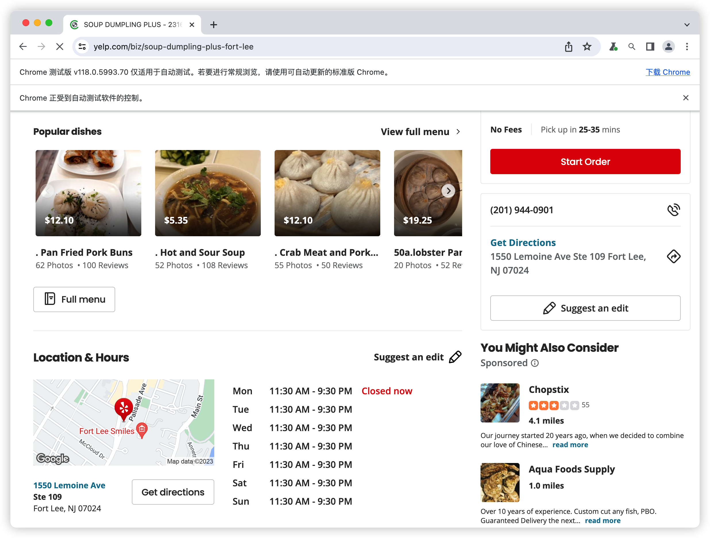
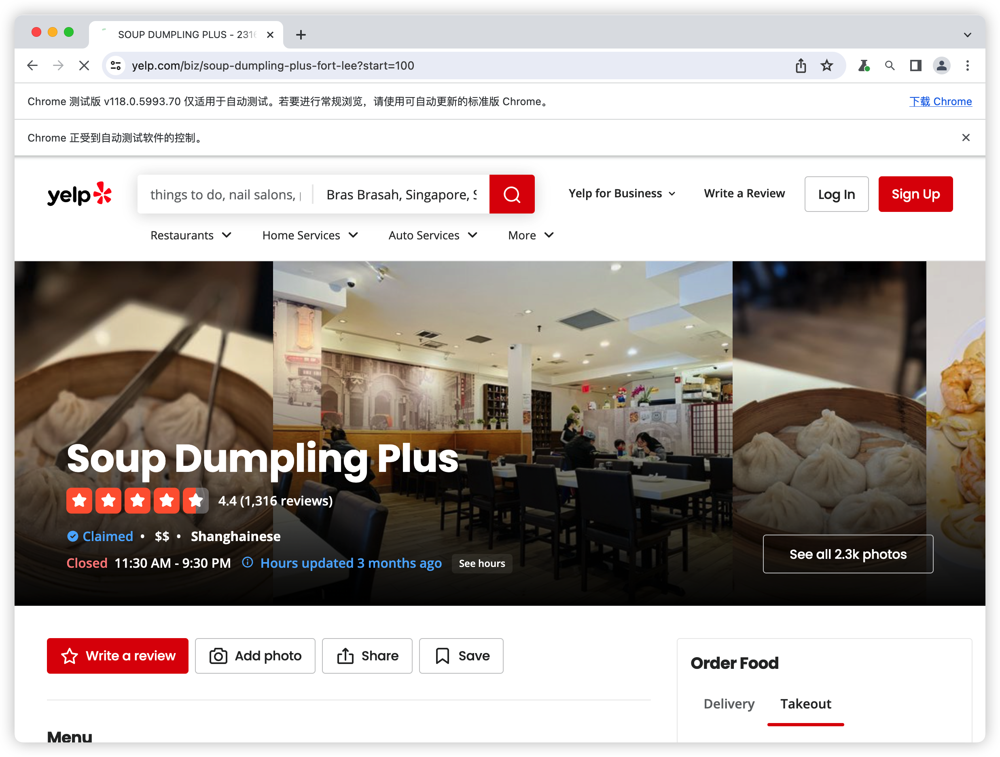
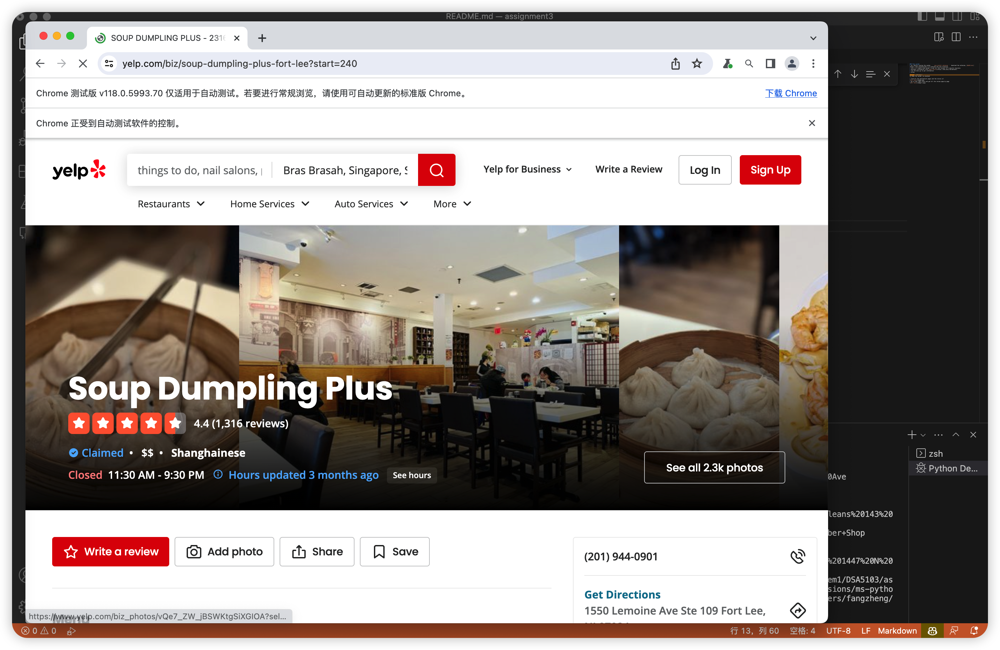

### Yelp spider
* ps: before running the spider, ``` pip install selenium ``` download the selenium, [WebDriver](https://www.selenium.dev/) to simulate the user browsing. 
* this is a simple used spider to get all the reviews to a specific business
* business information from [open source](https://www.yelp.com/dataset)
* run the main.py to get information
* using 
```
options = Options()
to keep the spider run backend 
```
* find all the penitential pages and the stores url

* go to the right store and get all the review page by page

